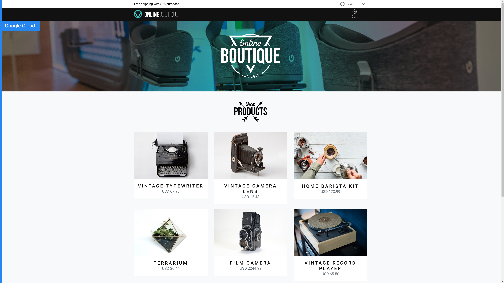

<p align="center">

</p>

**Online Boutique** is a cloud-native microservices demo application.
Online Boutique consists of a 12-tier microservices application. The application is a
web-based e-commerce app where users can browse items,
add them to the cart, and purchase them.
## Screenshots

| Home Page                                                                                                         | Checkout Screen                                                                                                    |
| ----------------------------------------------------------------------------------------------------------------- | ------------------------------------------------------------------------------------------------------------------ |
| [](./docs/img/online-boutique-frontend-1.png) | [](./docs/img/online-boutique-frontend-2.png) |

## Cloning instructions
This repository has a [couponservice](https://github.com/bobbsley/couponservice) submodule. In order to clone this repository:
```shell
git clone https://github.com/bobbsley/microservices-demo
cd microservices-demo/src/
git submodule init
git submodule update
```

## Quickstart (Local Deployment)
Please make sure you have updated the [couponservice](https://github.com/bobbsley/couponservice) submodule, as to be seen in cloning instructions.
## Prerequisites 
- [Docker for Desktop v.20.10.3](https://www.docker.com/products/docker-desktop).
- [kubectl v.1.20](https://kubernetes.io/docs/tasks/tools/install-kubectl/)
- [skaffold v.1.20]( https://skaffold.dev/docs/install/)
- [Kind v. 0.9.0](https://kind.sigs.k8s.io/) 


1. Launch a local Kubernetes cluster with **Kind**:
      ```shell
      kind create cluster
      ```

2. Run `kubectl get nodes` to verify you're connected to the respective control plane.

3. Run `skaffold run .` 
   This will build and deploy the application. In case of encountering an error please run `skaffold run .` again.

4. Run `kubectl get pods` to verify the Pods are ready and running. Example output:
```
NAME                                     READY   STATUS    RESTARTS   AGE
adservice-7864dd4cc6-wqwwx               1/1     Running   0          15m
cartservice-5cfc6d88b4-gd5rl             1/1     Running   0          15m
checkoutservice-6d84d45677-9lbdl         1/1     Running   0          15m
couponservice-959488bf6-lsvc9            1/1     Running   0          15m
currencyservice-7985bf6bf7-sqkgw         1/1     Running   0          15m
emailservice-7fb4d57795-mb8hx            1/1     Running   0          15m
frontend-867896449-p62kb                 1/1     Running   0          15m
loadgenerator-cb668d544-5ljmn            1/1     Running   0          15m
paymentservice-799fcfff5c-wssbr          1/1     Running   0          15m
productcatalogservice-59f97cd8dc-fd9vf   1/1     Running   0          15m
recommendationservice-78f874fb46-vvz8g   1/1     Running   2          15m
redis-cart-54b7cc9c97-qttw6              1/1     Running   0          15m
shippingservice-658f97bbcf-v4xnl         1/1     Running   0          15m
```

5. Forward the port 8080 to be able to access the front end 
    ```shell
    kubectl port-forward deployment/frontend 8080:8080
    ```

6. The web shop is accessible under http://localhost:8080

## Architecture

**Online Boutique** is composed of 12 microservices written in different
languages that talk to each other over gRPC. See the [Development Principles](/docs/development-principles.md) doc for more information.

[](./docs/img/architecture-diagram.png)

Find **Protocol Buffers Descriptions** at the [`./pb` directory](./pb).

| Service                                              | Language      | Description                                                                                                                       |
| ---------------------------------------------------- | ------------- | --------------------------------------------------------------------------------------------------------------------------------- |
| [frontend](./src/frontend)                           | Go            | Exposes an HTTP server to serve the website. Does not require signup/login and generates session IDs for all users automatically. |
| [cartservice](./src/cartservice)                     | C#            | Stores the items in the user's shopping cart in Redis and retrieves it.                                                           |
| [productcatalogservice](./src/productcatalogservice) | Go            | Provides the list of products from a JSON file and ability to search products and get individual products.                        |
| [couponservice](./src/couponservice)                 | Go            | Validates the coupon code                                                                                                         |
| [currencyservice](./src/currencyservice)             | Node.js       | Converts one money amount to another currency. Uses real values fetched from European Central Bank. It's the highest QPS service. |
| [paymentservice](./src/paymentservice)               | Node.js       | Charges the given credit card info (mock) with the given amount and returns a transaction ID.                                     |
| [shippingservice](./src/shippingservice)             | Go            | Gives shipping cost estimates based on the shopping cart. Ships items to the given address (mock)                                 |
| [emailservice](./src/emailservice)                   | Python        | Sends users an order confirmation email (mock).                                                                                   |
| [checkoutservice](./src/checkoutservice)             | Go            | Retrieves user cart, prepares order, applies the discount and orchestrates the payment, shipping and the email notification.      |
| [recommendationservice](./src/recommendationservice) | Python        | Recommends other products based on what's given in the cart.                                                                      |
| [adservice](./src/adservice)                         | Java          | Provides text ads based on given context words.                                                                                   |
| [loadgenerator](./src/loadgenerator)                 | Python/Locust | Continuously sends requests imitating realistic user shopping flows to the frontend.                                              |


## CouponService Integration
The following services have been changed in order to integrate with **CouponService**:
- **Frontend** 
  - Coupon Code field added to the checkout HTML template
  - Coupon Code added to the PlaceOrderRequest ProtoBuf
- **CheckoutService**
  - Generate CouponRequest to **CouponService** with the CouponCode inputted in FrontEnd
  - Money Multiplication logic added
  - Apply the discount from CouponResponse to the order
- **Load Generator**
  - Discount Codes added to mock requests
---

This is not an official Google project.
